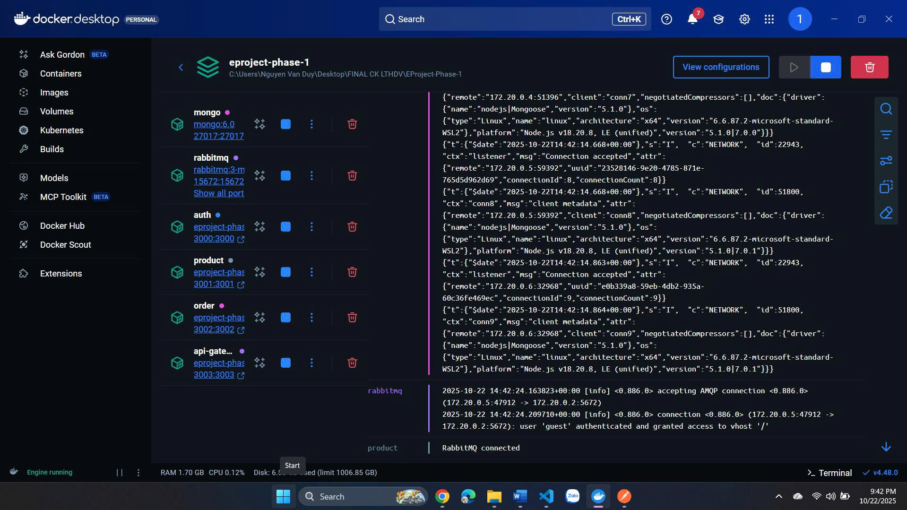
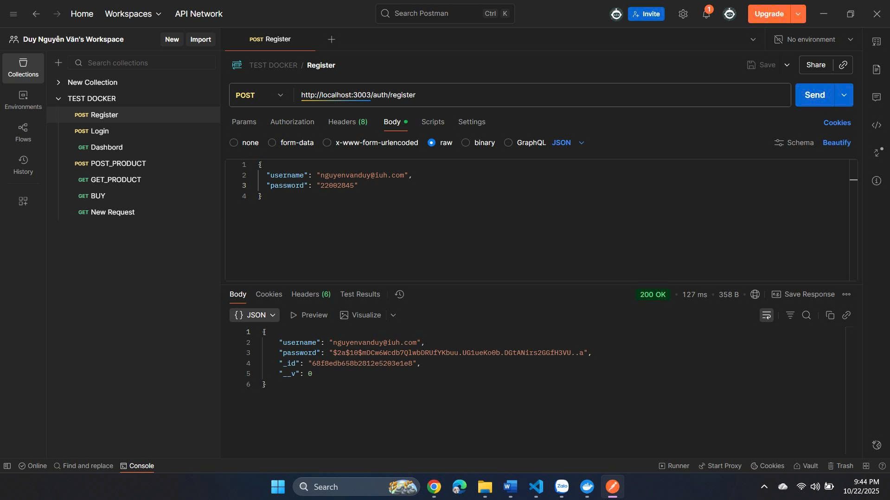
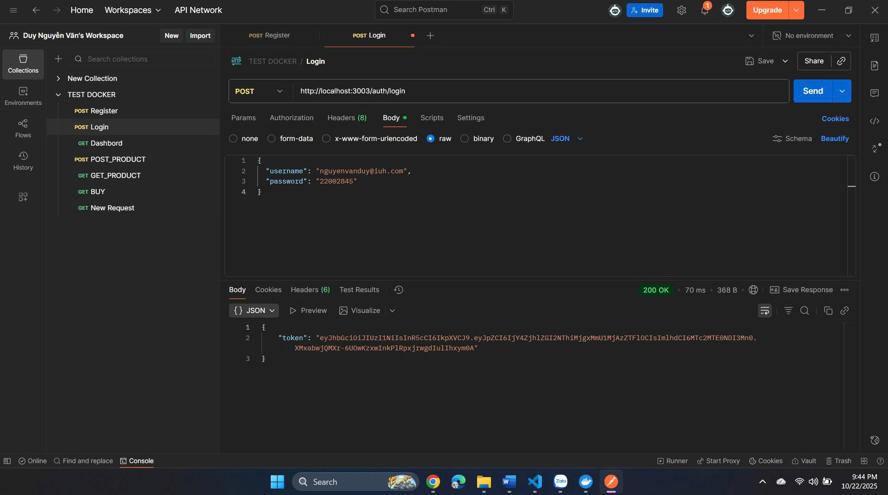
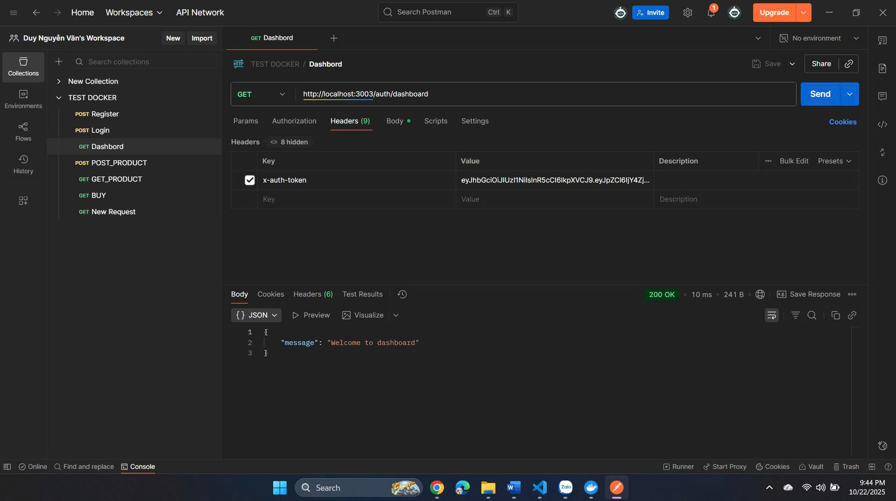
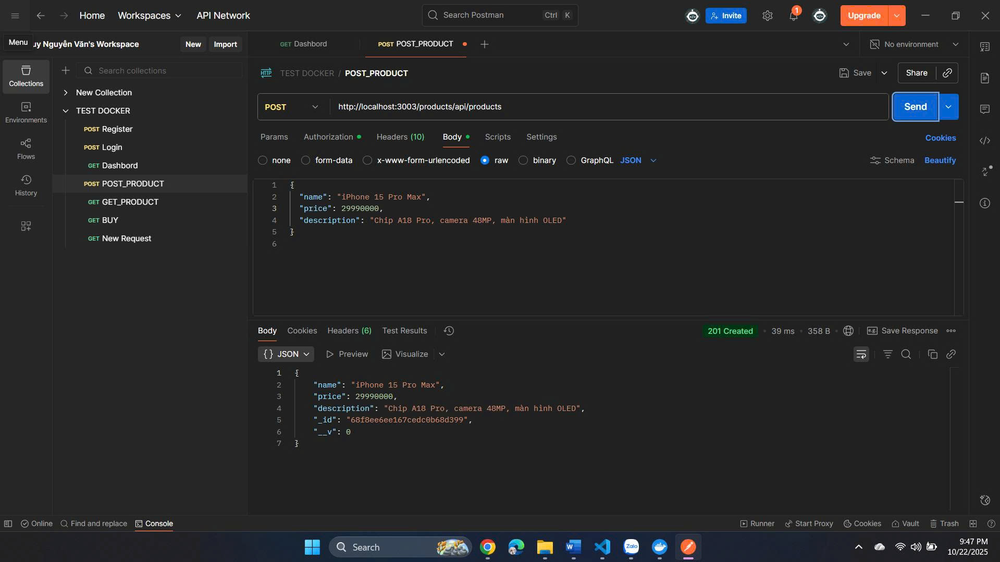
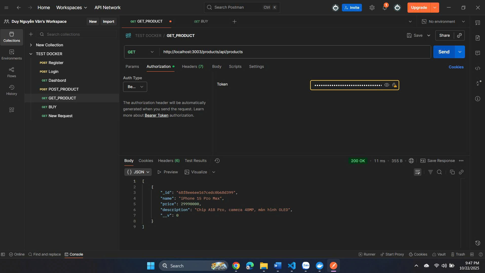
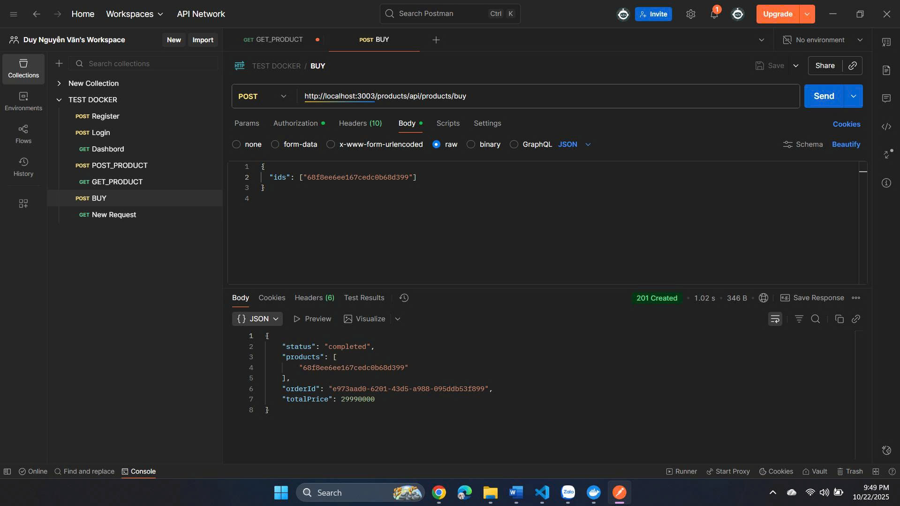
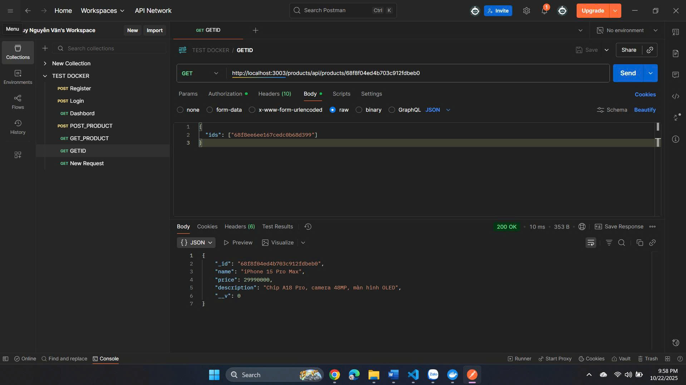
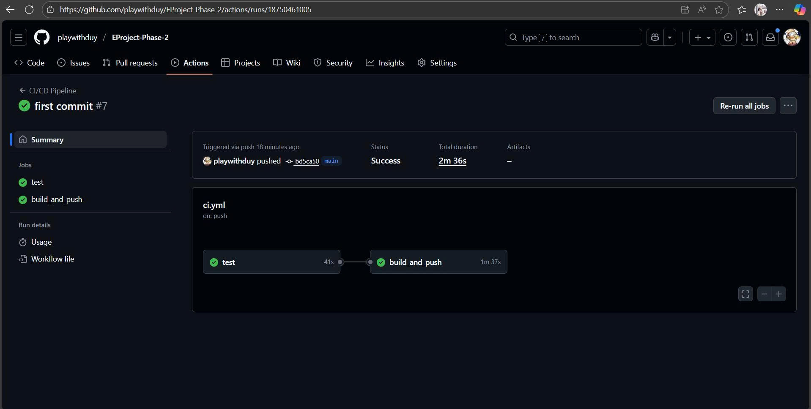
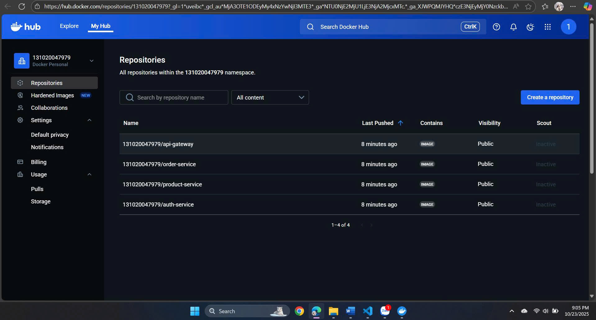

# 🌐 EPROJECT PHASE 2 — HỆ THỐNG MICROSERVICES NODE.JS

EPROJECT PHASE 2 là giai đoạn đầu của hệ thống thương mại điện tử, được xây dựng bằng Node.js với kiến trúc Microservices.
Mục tiêu của dự án là xây dựng nền tảng backend cơ bản cho việc đăng ký, đăng nhập, quản lý sản phẩm và đặt hàng, làm tiền đề mở rộng sang hệ thống hoàn chỉnh ở giai đoạn sau.

Link github: https://github.com/playwithduy/EProject-Phase-2

## ⚙️ Công nghệ sử dụng

- **Node.js**, **Express.js** – Xây dựng API backend  
- **MongoDB (Mongoose)** – Lưu trữ dữ liệu  
- **JWT Token**, **bcryptjs** – Xác thực & mã hóa mật khẩu  
- **dotenv** – Quản lý biến môi trường  
- **Docker** – Triển khai hệ thống Microservices  
- **Postman** – Kiểm thử API  
- **GitHub Actions (CI/CD)** – Tự động hóa build & deploy

## 🧩 Kiến trúc hệ thống
Hệ thống gồm 3 dịch vụ chính:

1. **Auth Service** – Quản lý người dùng: đăng ký, đăng nhập, xác thực JWT  
2. **Product Service** – Quản lý sản phẩm: thêm, xem danh sách, xem chi tiết và mua sản phẩm  
3. **Order Service (khởi đầu)** – Xử lý thao tác mua hàng, kết nối giữa Product & Auth  

Tất cả các service giao tiếp thông qua **API Gateway** (port `3003`).

docker compose down -v
docker compose build
docker compose up -d

## 🐳 Docker
Hệ thống hoạt động trên Docker

## 🧪 Test API (Postman)
### 1️⃣ REGISTER

### 2️⃣ LOGIN

### 3️⃣ TRUY CẬP DASHBORD (YÊU CẦU TOKEN)

### 4️⃣ POST PRODUCT

### 5️⃣ GET PRODUCT

### 6️⃣ BUY 

### 7️⃣ GET PRODUCT ID

⚙️ CI/CD và GitHub Actions

# Dự án tích hợp GitHub Actions để tự động build và test khi có commit mới.
# CI/CD liên kết với Docker, giúp triển khai nhanh chóng các service lên môi trường container hóa.

## 👨‍💻 Sinh viên
**Nguyễn Văn Duy**  
# MSSV: 22002845  

